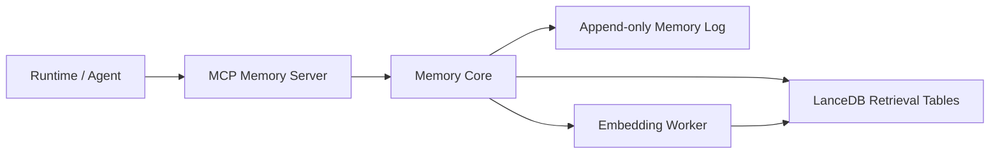

# MCP Memory Layer Architecture

This document defines the recommended shape for a local-first MCP memory layer for agent and coding workflows.

The core decision is:

- use **LanceDB** for retrieval and indexing in v0 to early v1
- keep a separate **append-only canonical memory log** in the application layer
- expose a stable MCP-facing memory contract that does not depend on one storage engine

This is the same pattern AgentBus uses elsewhere:

- transport is not the product
- the storage engine is not the product
- the real product is the contract and behavior around durable memory

## Target Outcome

The desired user experience is:

1. An agent or runtime can write memory without knowing storage details
2. Retrieval is scoped correctly by user, project, container, and session
3. Memory recall works for exact terms and semantic similarity
4. The system can build task-ready context for an LLM without leaking unrelated memory
5. The memory layer stays easy to run locally in development
6. The storage engine can be replaced later without rewriting MCP tools

## Why LanceDB

LanceDB is the current recommendation because it fits the actual workload better than a heavier remote-first vector stack.

Strengths for this use case:

- local-first embedded operation
- TypeScript and Python support
- scalar filtering
- full-text search
- vector search
- hybrid retrieval
- table versioning and reproducible reads

That makes it a strong fit for:

- project-scoped memory
- coding assistant memory
- document plus episodic memory
- laptop-first or single-node deployment

It is not the whole memory system though.

## Non-Goals

This design does not try to be:

- the final globally distributed memory platform
- a full relational source of truth for every domain object
- a replacement for application event logs or audit trails
- a product-specific orchestration layer

If the system later needs heavy joins, high-write transactional behavior, or shared distributed vector infrastructure, the storage choice may change.

## Design Principles

### 1. Canonical log first

The source of truth is an append-only memory log owned by the application layer.

LanceDB is derived from that log for retrieval.

This protects:

- auditability
- replay
- reindexing
- migration to another engine

### 2. Scope is mandatory

Every memory record must belong to explicit scope boundaries before it can be retrieved.

Required scope dimensions:

- `userId`
- `projectId`
- `containerId`
- `sessionId`

Not every record needs every field, but retrieval must never fall back to unscoped global search by accident.

### 3. Hybrid retrieval beats vector-only retrieval

Semantic search is useful, but memory quality depends on combining:

- metadata filters
- keyword or FTS search
- vector similarity from embeddings
- reranking with recency and importance

### 4. Retrieval modes are explicit

Different callers need different memory budgets.

The memory layer should support explicit retrieval modes such as:

- `profile`
- `query`
- `full`
- `recent`

This follows the useful pattern seen in the earlier `supermemory` study: callers should choose relevance and cost intentionally.

### 5. MCP is a surface, not the core

The MCP server should expose memory tools and resources.

It should not own:

- ranking logic
- dedup policy
- embeddings pipeline
- data migration logic

Those belong in the memory core.

## System Shape



## Core Components

### MCP Memory Server

This is the transport-facing layer.

Responsibilities:

- expose memory tools
- expose memory resources
- validate request shape
- pass normalized requests into memory core

It should stay thin.

### Memory Core

This is the real product logic.

Responsibilities:

- normalize inbound writes
- assign stable IDs and scopes
- append to canonical log
- build derived retrieval records
- enforce filters
- execute hybrid retrieval
- rerank by recency and importance
- deduplicate overlapping results
- build model-ready context blocks

### Canonical Memory Log

This stores write-time truth.

Recommended properties:

- append-only by default
- explicit event type
- stable memory IDs
- source references
- timestamps
- operator or runtime identity

This log can live in JSONL, SQLite, Postgres, or another durable store.

The design does not require LanceDB to act as the canonical write log.

### LanceDB Retrieval Tables

These are derived tables optimized for read quality.

Recommended table families:

- `memory_records`
- `memory_chunks`
- `memory_summaries`
- `memory_index_runs`

The exact physical shape can evolve, but the logical contract should remain stable.

### Embedding Worker

Embedding generation should be asynchronous when possible.

Responsibilities:

- generate embeddings for new or changed records
- backfill missing embeddings
- re-embed when model choice changes
- mark index version and embedding version

## Memory Model

The canonical record should be simple and durable.

Suggested shape:

```ts
export interface MemoryRecord {
  id: string;
  kind: "fact" | "conversation" | "decision" | "doc" | "task";
  scope: "global" | "user" | "project" | "session";
  userId?: string;
  projectId?: string;
  containerId?: string;
  sessionId?: string;
  source: {
    type: "manual" | "chat" | "tool" | "document" | "system";
    uri?: string;
    title?: string;
  };
  content: string;
  summary?: string;
  tags: string[];
  importance: number;
  createdAt: string;
  updatedAt?: string;
}
```

Key idea:

- canonical records describe meaning and ownership
- retrieval records can be chunked, embedded, and reshaped independently

## Retrieval Pipeline

Recommended read flow:

1. validate caller scope
2. enforce hard filters for `userId`, `projectId`, `containerId`, and optionally `sessionId`
3. run FTS or exact-match retrieval for precise terms
4. run vector retrieval on the same scoped subset
5. merge and rerank by:
   - semantic score
   - keyword score
   - recency
   - importance
6. deduplicate overlapping or near-identical items
7. build a compact context block for the caller

This avoids the common failure mode of vector-only recall returning vaguely related but operationally wrong memory.

## Write Pipeline

Recommended write flow:

1. receive a write request
2. normalize scope and source metadata
3. append to canonical log
4. derive retrieval row or chunk rows
5. schedule embedding work if needed
6. update FTS and scalar indexes
7. expose the new memory for retrieval after indexing is complete

If immediate consistency is required for a narrow case, the server may do synchronous embedding for small writes.

## MCP Surface Direction

The minimum useful tools are:

- `remember`
- `search_memories`
- `build_context_for_task`
- `upsert_document`
- `list_memories`

Useful resources:

- `memory://profile`
- `memory://projects/{projectId}`
- `memory://recent`
- `memory://decisions/{projectId}`

The exact request and response shapes are defined in `./v0-contract.md`.

## Observability and Audit

The memory layer should log enough to explain why a retrieval happened.

At minimum, log:

- query text
- retrieval mode
- enforced filters
- returned memory IDs
- ranking inputs
- final context payload size
- embedding model version
- index version

Without this, tuning memory quality becomes guesswork.

## Migration Triggers

Stay on LanceDB while the following remain true:

- local-first or single-node operation is the default
- retrieval quality depends more on ranking policy than cluster-scale vector ops
- domain data does not require complex relational joins during retrieval

Revisit the engine choice if:

- relational joins and transactions become central to memory reads or writes
- p95 latency becomes unacceptable under shared multi-user load
- you need distributed remote vector serving as a first-class platform capability

Likely migration directions:

- **Postgres + pgvector** if memory becomes relational and transaction-heavy
- **Qdrant** if shared remote vector infrastructure becomes the main problem

## Recommended v0

Build v0 with these constraints:

- one canonical memory record shape
- one embedding model
- one LanceDB-backed retrieval path
- strict project and user scoping
- hybrid retrieval only
- simple reranking with recency and importance
- explicit rebuild and reindex commands

Do not start with:

- many memory classes with different pipelines
- multiple vector engines
- speculative distributed deployment
- product-specific logic mixed into MCP handlers

## Summary

The correct first move is not “build a huge memory platform.”

The correct first move is:

- a small durable memory contract
- a thin MCP surface
- a real memory core
- LanceDB as the retrieval engine
- an append-only canonical log so the system stays explainable and replaceable
