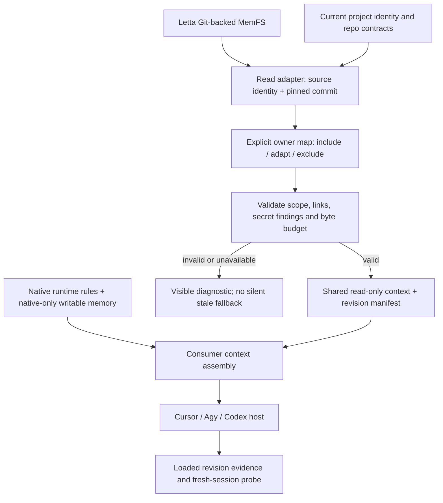
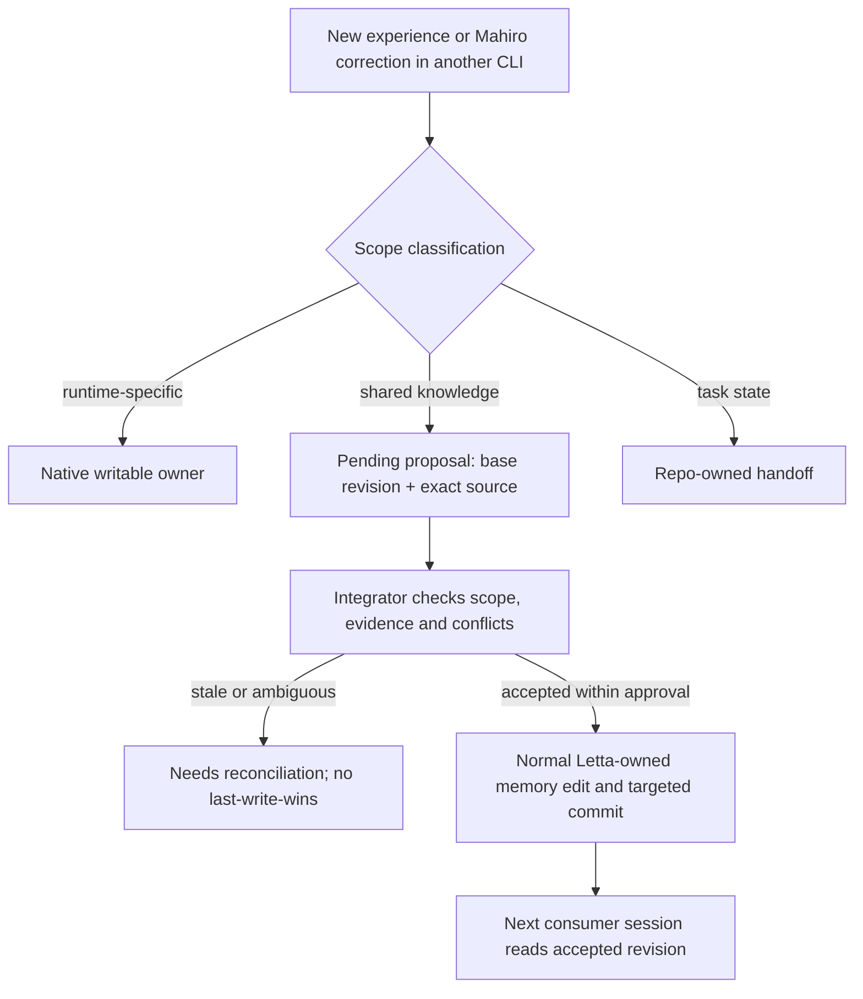

# แผนอ่าน Letta memory ร่วมกันโดยไม่เพิ่ม store กลาง

วันที่: 2026-10-02 · สถานะ: Shared communication เปิดใช้ใน Cursor/Agy แล้ว ผ่าน fresh native-host checks; source acceptance และ human workflow review ยังเป็นของ Mahiro

Latest release checkpoint: Cursor `v0.2.0` and Agy `v1.24.0` were committed, pushed, and published after Mahiro's 20:32 release approval; remote tags/releases were read back and both primaries are clean. Standalone use requires no Letta installation. After Mahiro's 21:35 approval, the new communication clause was committed alone as `7fad97e8a4dfbc751a0bb17c5230facb1bf51f83` and verified in both actual newly assembled contexts. The original full-native proposal was retired after extracting only the approved clause; zero pending proposals remain. See the latest checkpoint in the evidence document for evidence-layer and historical boundaries.

## Historical pre-release integration checkpoint

Shared-read now uses committed `system/human/prefs/communication.md` from the existing Letta MemFS root. Cursor and Agy retain their own persona, runtime routing, project memory, recall, and learning mechanisms. No fourth canonical memory store was created.

Both verified adapters have been integrated into their primary checkouts without commits. Cursor-owned hooks/skill/CLI were updated through the official installer; Agy's existing installed plugin symlink already points at its updated primary checkout. Shared mode is enabled through each adapter's own settings.

Fresh interactive Cursor Opus5.5Medium and Agy Gemini3.8FlashHigh hosts retrieved the exact source SHA and communication facts while preserving native-only content. Agy additionally covered every active owner and a bounded deferred-reference lookup. Native file bytes, Git HEAD, and worktree status remained unchanged. Actual disable/re-enable returned native projections and left both adapters enabled.

New shared learning from Cursor/Agy remains **pending source review**. Proposal export/rejection is implemented and isolated native-entrypoint proofs pass; neither adapter silently accepts it into native communication or writes the canonical source. Unrelated native writes/deletes remain available. No real native/source memory commit was used as an acceptance proof.

Evidence, scope limits, exact rollback commands, and the retained superseded reports are documented in `docs/plans/shared-memory-integration-evidence-2026-10-02.md`. Artifact closeout is complete: canonical evidence now lives in each primary checkout's ignored `.agent-state/tmp/shared-memory-2026-10-02/`, with hash manifests and exact implementation parity verified. Worktrees are retained by choice; runtime and evidence do not depend on them. Earlier checkpoint sections below are historical, not current runtime state.

## Latest scope — 2026-10-02

### Current implementation state — 15:20 Bangkok

#### Checkpoint update — 16:32 Bangkok

Current hypothesis ledger (Fablebounded modeหลังstatic/report PASSไม่ตรงactualnative-content behavior):

| ID | Claim | Evidence / counterexample | State / next |
| --- | --- | --- | --- |
| H1 | Runtime enabled policyไม่ถูกcallerลดลง | Mainreplay caller `enabled:false` bypassครั้งแรก; follow-upแก้monotonic effective configและMainreplayถูกreject | Supportedตามdirect API probe; ไม่ใช่OS sandbox |
| H2 | Flat/list-block dedupรักษาnativeทุกแบบ | Actual-source duplicate, same-heading nested childlossและlist-vs-paragraph lossrefuteคำกล่าวกว้าง แม้tests/reportPASS | Refuted; ไม่ใช้PASS countแทนpreservation |
| H2b | Owner/context-bound structural unitsรักษาnative contentในsupportedformats | Cursor tinyfixเก็บparent+childrenและnativeintro; formatter/check +29 focused testsผ่าน; freshreviewfollow-upกำลังลองcounterexamples | Active; native lossใด ๆเป็นblockerไม่ใช่futurepolish |
| H3 | Native hooksพร้อมใช้งานliveจากsourcechecks | CursoractualCLIstatuspinned9dและCLI→proposalno-writeผ่าน; AgyactualPreInvocation4chunks<=40000bytes/commonclauseonce แต่compileล่าสุดfailed | Queuedจนcode/retentionผ่าน; helper/CLIไม่ใช่freshhostsemanticproof |

Cursorfinal reviewerรายงานaccepted +111 tests แต่รายงานเองมีnative paragraph omission Mainreplayยืนยันและinvalidateเฉพาะhardpreservation verdict แล้วแก้anchored6lines +regressionsให้reviewerตรวจใหม่ ไม่ถือreportว่ารับรองhuman contractครบทุกข้อ

Agyinitialwriterreportไม่ตรงsourceหลังlatestchanges: Main `tsc --noEmit`ยืนยัน3errors (missingwrite-lockimport, null `.trim`สองตำแหน่ง), reviewพบ32/34 sharedtestsผ่านและmergernested/labels defects Correctionlaneใหม่กำลังแก้ตรงshapesและต้องcapturechecksหลังlastedit; originalreportเก็บเป็นsuperseded/rejected evidence ไม่ใช้claimready

No live activation, source rewrites, repository commits/push/publishจากlaneนี้ ยังไม่สรุปmissioncompleteจากreportหรือtestsเพียงชั้นเดียว

Mahiroอนุมัติให้ทำที่เหลือต่อจนเสร็จเมื่อ14:37 หลังทบทวนworkflowของสามhostแล้ว ขอบเขตคือopt-in shared communicationในCursor/Agy, native additions/learningต้องอยู่ครบ, pending source-review path, isolated/fresh-host proofและreversible activation ไม่รวมcommit/push/publishหรือautomatic source-memory rewrite และhuman workflow acceptanceยังเป็นของMahiro

- Cursor baseใหม่คือ`3aa1358` งานpublic-readinessเดิมถูกcommitก่อนเริ่มfeature ใช้branch `letta/shared-memory-cursor-fe5fe2fd` ใน `/Users/mahiro/ghq/github.com/mahirocoko/cursor-memory-layer/.letta/worktrees/shared-memory-cursor`
- Writerรายงานcheckผ่านและ102 testsผ่าน แต่fresh reviewerพบ5blockersและ2observations Mainreplayยืนยันactual-source duplicate clausesและheading conflict defectแล้ว จึงไม่activateจากtest count
- Correction writerใหม่เป็นAgy/Gemini3.8FlashHigh; ownerคืองานCursorcheckoutเดิมเท่านั้น ต้องแก้lower-levelrepository/repair bypassเพิ่มจากreviewด้วย
- Agyใช้branch `letta/shared-memory-agy-73ca0267` ใน `/Users/mahiro/Git/me/sandbox/learn-letta-code/.letta/worktrees/shared-memory-agy` มีwriterแยกrepoและได้รับvettedCursordefectsแล้ว ห้ามcopyimplementationที่ยังไม่ผ่านreviewแบบblind
- Live source/native storesและsettings/hooksยังไม่ถูกเปลี่ยน ไม่มีsource acceptanceหรือcommitsจากlaneนี้ Pending proposalsไม่ใช่accepted knowledge
- Exact lane prompts, receiptsและreportsอยู่ใต้แต่ละworktree `.agent-state/tmp/shared-memory/` ผู้คุมต้องcollectจากreceipt-boundreport ไม่เลือกglobally newest file
- ยังเหลือcorrection/audit, Agy independent review, fresh Cursor/Agy host checks, proposal/disable/rollback proof, activationและfinal docs/evidence ไม่ถือว่าmissionเสร็จจากwriter terminal report

Mahiroยืนยันว่า switch บ่อยระหว่าง Letta/Agy/Cursor และต้องรักษา native memory-layer learning ของ Agy/Cursor ไม่ลดทั้งระบบเหลือ read-only loader Codex CLI ไม่ใช่ requirement ปัจจุบัน ส่วน read-only inventory/reconciliation ทำแล้ว ดู [ผลตรวจและ pilot candidates](shared-memory-inventory-2026-10-02.md)

ทำ automatic shared read เป็น pilot direction แต่ไม่สร้าง store/service ใหม่ การให้ Lettaเป็น shared source เริ่มต้นไม่ใช่การแต่งตั้งผู้เขียนถาวร ต้องรักษาและทดลองนำ shared learningจาก native storesกลับอย่างตรวจได้ Round แรกอนุมัติเพียง inventory/report; implementation, provider host proof และ live activation ยังแยก scope

Mahiroสั่ง `ต่อ` หลัง inventory และได้รัน isolated Cursor communication proofหนึ่ง off/onคู่แล้ว: [ผล host proof](shared-memory-cursor-proof-2026-10-02.md) ผ่านเฉพาะ selected-slice delivery/recall; prototypeอยู่ใน ignored personal scratch ไม่แก้ adapter sourceหรือlive stores Guards, native-overlay integration, Agy proofและlive activationยังไม่ผ่าน

Mahiroอนุมัติทดลอง overlay ต่อ (`จัดไป`) และได้ทำ [offline owner-guard proof](shared-memory-overlay-proof-2026-10-02.md): ห้า reviewed unitsและ27 focused self-checksผ่าน แต่ mutation channelsเป็น fixtures ไม่ได้เชื่อม installed CLI/reflection ยังไม่ถือว่า native overlay integrationหรือlive write protectionผ่าน

หลังคำสั่ง `ต่อ` ได้เชื่อมguardกับ[real mutation entrypointsในpinned source copy](shared-memory-entrypoint-proof-2026-10-02.md): 19 focused self-checksผ่าน ไม่มีcommits/live activation Native learning gateยังเป็นconservative fixture policyไม่ใช่production policy และoriginal Cursor sourceมีงานout-of-scopeที่ต้องreconcileก่อนนำpatchกลับ

## เป้าหมาย

ขณะที่ Letta ยังเป็น main ให้ Cursor, Agy และภายหลัง Codex อ่านความรู้ร่วมที่มีเจ้าของเดิมได้ โดยไม่สร้าง preference หลายชุดที่ต่างฝ่ายต่างแก้เอง รักษาบทเรียนใหม่ของแต่ละ CLI และเปิดทางย้าย authoring owner หากเลิกใช้ Letta

รอบนี้สร้างแผนเท่านั้น ไม่มีการติดตั้ง แก้ hooks เขียน live memory หรือเปิด provider proof

## Current Reality

- Letta Main ใช้ Git-backed MemFS แบบ `system/` สำหรับ core และไฟล์รายละเอียดนอก `system/` เป็น external memory
- Cursor source ที่ตรวจ: `f21fc28` มี committed projection, native recall, writable memory และ reflection ของตัวเอง
- Cursor live memory เป็น Git repo แยก วันที่ 2026-09-26 เคย import Mahiro Code Markdown แบบ one-way บันทึกระบุว่าสอง store ไม่ได้เชื่อมกันหลัง import
- Agy source ที่ตรวจ: `818eb11`, v1.23.0 มี committed projection และ LLM Dream แบบ manual + human-gated; importer เดิมค้น layout `~/.letta/agents/` ไม่ตรงกับ local Main ที่ตรวจ
- Codex CLI ที่ตรวจ: 0.159.3; official docs รองรับ instruction files และ MCP แต่ยังไม่มี host proof ของ adapter เรา
- Native defaults/source ไม่เท่ากับ effective installed configuration ต้องตรวจใหม่ก่อน activation

เจ้าของหลักฐาน:

- Cursor source: `/Users/mahiro/ghq/github.com/mahirocoko/cursor-memory-layer`
- Agy source: `/Users/mahiro/Git/me/sandbox/learn-letta-code`
- Letta Main store ปัจจุบัน: `/Users/mahiro/.letta/lc-local-backend/memfs/agent-local-b1f7b85c-d49d-43ea-a7e3-6fa085ecd426/memory`
- Cursor import provenance: `/Users/mahiro/.cursor/memory/cursor-memory-layer/reference/budget-statusline-letta-import.md` — historical measurements; current scope/budget ดู source ไม่ใช้ note เก่าเป็นค่า effective

## Ownership ที่เสนอ

| ข้อมูล | Authoring owner | Consumer อื่น |
| --- | --- | --- |
| ความเข้าใจ Mahiroและบทเรียนร่วมที่ยอมรับแล้ว | Letta MemFS ปัจจุบัน | อ่าน committed revision ผ่าน adapter |
| Current project contract | Repo docs/source | Memory ชี้ไป owner และต้อง recheck เมื่อทำงาน |
| Runtime persona, hooks, CLI quirks | Native adapter/store | ไม่ mirror ทั้งก้อน |
| Shared learning ที่เกิดนอก Letta | Proposal ที่ยังไม่ active | Integrate ที่ owner เดิมหลังตรวจ/อนุมัติ |
| Transcript/recall | Native runtime | ไม่รวม raw history ใน phase นี้ |
| งานกลางทาง | Repo-owned handoff | มี revision/evidence/blockers ไม่เป็น standing preference |
| Permissions | Runtime และ approval ของงานปัจจุบัน | ห้ามสืบทอดสิทธิ์จาก memory/handoff |

Letta ไม่โหลด adapter output กลับเข้าตัวเอง จึงไม่มี shared block ซ้ำใน context ของ Main

## Flow 1 — การอ่านเมื่อเริ่ม session

### Read contract

1. เลือก agent/store ชัดเจน ไม่ค้นแล้วใช้ agent ตัวแรกหรือใช้ค่าของ consultation lane เป็น installed config
2. Resolve project identity พร้อม explicit alias map ห้ามถือ basename อย่างเดียวเป็น canonical ID; remote URL ต้องไม่เผย credential และบาง repo ไม่มี remote
3. Resolve commit SHA ครั้งเดียว แล้วอ่านทุกไฟล์ด้วย SHA เดียวกัน ไม่อ่าน `HEAD` ใหม่ทีละไฟล์จน bundle ผสม revision
4. อ่าน committed bytes แม้ working tree dirty ได้ แต่รายงาน dirty status แยก ห้ามนำไฟล์ dirty ไป active หรือแก้เพื่อให้ clean
5. ใช้ bounded explicit owner map สำหรับ human preferences และหนึ่งโปรเจกต์ ไม่ mirror ทั้ง tree; external memory ของ Letta ไม่ได้กลายเป็น core ของ Cursorเพราะชื่อ folder เหมือนกัน
6. แต่ละ unit จำแนก portable knowledge, host-dependent guidance หรือ excluded; ไม่ retarget คำสั่งและ identity ด้วย regex ทั้งก้อน
7. เก็บ wording ของ selected units ตามต้นฉบับ ถ้าต้อง adapt ให้มี mapping/provenance ที่ตรวจได้ ไม่สรุปให้เล็กเงียบ ๆ
8. มี bootstrap ที่พอใช้จริง พร้อมทางอ่านรายละเอียด on demand ที่ผูกกับ revision เดียวกัน ไม่ถือว่าลิงก์เท่ากับโหลดเนื้อหาแล้ว
9. Budget ดู host จริง รวม native/context envelope และ units ที่เลือก ใช้ UTF-8 bytes เมื่อ host contract เป็น bytes; ไม่แปลง character/token estimate เป็น transport guarantee
10. Secret findings ต้อง block affected bundle และรายงานเฉพาะ path/rule ไม่พิมพ์ raw value ไม่แก้ source โดยไม่ได้รับอนุมัติ
11. Manifest ระบุ source identity, commit, project ID, adapter version, selected/excluded owners และ bundle hash; metadata นี้ไม่ใช่ security signature
12. Consumer ต้องแสดง loaded revision เมื่อ inspect ได้; session เดิมไม่ hot-reload โดยอัตโนมัติ ข้อห้าม/decision ที่เปลี่ยนต้องมี refresh หรือ recheck gate ตามความเสี่ยง

Output อาจอยู่ใน memory/in-process bundle หรือ disposable derived cache ตาม host ไม่ใช่ canonical store อีกชุด Cache ถ้ามีต้อง read-only, revision-bound และ regenerate ได้ ไม่มี reflection

## Flow 2 — การเรียนรู้กลับ

### Write contract

- Shared input และ native writable input แยก namespaces/owners จริง ไม่ใช่แค่ติดคำว่า read-only ใน prompt
- CLI writes และ reflection ต้องปฏิเสธการแก้ shared owners และไม่สร้าง local preference ที่แอบ override owner กลาง
- Proposal ระบุ base revision, target owner, exact change, scope และ source conversation/evidence locator; raw transcript ไม่จำเป็นต้องคัดลอกเข้ากลาง
- ข้อความที่ inject มาไม่ใช่ new experience ห้าม reflection ส่งกลับเป็นบทเรียนใหม่โดยไม่มีหลักฐานเพิ่มเติม
- Phase แรก proposals เป็น reviewable artifacts ไม่ active; memory approval ยังเป็นของ Mahiroตามขอบเขตที่อนุมัติ ไม่ให้ agent consumer เขียน Letta โดยตรง
- ไม่เพิ่ม Letta-core integration หรือสันนิษฐานว่า external writer ใช้ lock/merge policy ของ Letta ได้
- Proposal storage owner/format ต้องเลือกก่อน implementation; เริ่มใน repo-owned ignored workspace ของ adapter ได้ ไม่สร้าง global inbox/daemon ทันที

## แผนดำเนินการและ approval gates

| Phase | ทำอะไร | สิ่งส่งมอบ/หลักฐาน | ขอบเขต |
| --- | --- | --- | --- |
| 0 — Inventory | ตรวจ native roots/hooks, import history และ current owners; diff Cursor fork กับ Letta เฉพาะหัวข้อที่เลือก | Include/Adapt/Keep-local/Propose/Historical map, unresolved conflicts และ source revisions | Read-only; ไม่ activate |
| 1 — Cursor read proof | เพิ่ม opt-in committed reader และ context assembly สำหรับ isolated memory root; หนึ่งโปรเจกต์ก่อน | Dry-run bundle/manifest, scope/byte/secret/link checks และ fixture counterexamples | แก้ source Cursor หลังอนุมัติ ไม่แก้ live hooks/store |
| 2 — Fresh host proof | เปิด Cursor session แยก ตรวจ selected facts ที่อยู่เฉพาะ Letta และ runtime constraints | Attribution, source revision, omitted-owner behavior, console/transport diagnostics ที่ host มี และ before/after invariance | Provider call ต้องแจ้งก่อน; local mode ยังไม่เปิดเป็น default |
| 3 — Reconcile + write separation | เก็บ Cursor-only learning, เสนอ shared delta กลับ owner เดิม, ปิด duplicate active shared owners | Exact migration manifest, backups, proposal path และ guards ทั้ง CLI/reflection | Live memory/hooks changes ต้องอนุมัติแยก; ยังไม่ลบ fork |
| 4 — One consumer activation | เปิด Cursor opt-in ผ่าน installed owner-local update แล้วทดสอบ session ใหม่ | Live loaded revision, conflict policy และ reversible config change | Mahiroตรวจว่า workflow ง่ายขึ้น ไม่ต้องดูแลสอง preference sets |
| 5 — Agy adaptation | Reuse proven read contract, แก้ source identity discovery และ owner mapping ของ Agy | Isolated Agy proof, chunk/byte checks และ original approval policy ไม่ลดลง | Activate Agy แยกจาก Cursor |
| Deferred — Codex entrypoint | ไม่อยู่ใน current requirement | พิจารณาเฉพาะเมื่อ Mahiroเริ่มใช้ CLI นี้จริงและขอเพิ่ม scope | ไม่ทำ adapter/config changes ในรอบนี้ |

Phase 0–2 เป็น pilot ที่เสนอเริ่มก่อน การอนุมัติแผนไม่ควรถูกตีความว่าอนุญาตทุก live migration/activation พร้อมกัน Commit/push/release ไม่รวมโดยปริยาย

## Repo impact

| Owner | ผลกระทบที่เสนอ | สิ่งที่ไม่ทำ |
| --- | --- | --- |
| `mahirocoko` personal workspace | แผนนี้และ shared discussion/proof index หากจำเป็น | ไม่กลายเป็น service หรือ runtime package ใหม่ |
| `cursor-memory-layer` | Opt-in source selector, pinned read projection, owner mapping, native/shared assembly, write/reflection guards, diagnostics, focused tests และ docs | ไม่เปลี่ยน default hook ใน pilot ไม่ใช้ `CURSOR_MEMORY_DIR` ตัวเดียวแทนทั้ง shared/native root |
| Cursor live memory/config | หลัง gate: reconcile imported shared owners, เก็บ native learning และเปิด reader แบบ reversible | ไม่ลบ imported fork หรือแก้ global config ใน pilot |
| `agy-memory-layer` | หลัง Cursor proof: source discovery ที่ตรง local Main, shared read projection และ native-only learning/proposal boundary | ไม่ใช้ `/sync-letta` importer เป็น automatic bidirectional sync ไม่เปิด LLM scheduling |
| Agy live memory/config | Opt-in activation ภายหลังพร้อมรักษา approved wording/transport | ไม่ overwrite memory ที่เคย curate และไม่ลด approval policy |
| Letta Main MemFS | อ่าน committed source เท่านั้น; accepted proposals อาจเป็น normal memory edits ภายหลัง | ไม่เพิ่ม consumer output กลับเข้า core ไม่เปิด external writer |
| Letta Code upstream | Read-only capability evidence หากจำเป็น | ไม่มี core patch, hooks หรือ reflection replacement |
| Codex configuration | ภายหลังมี scoped bootstrap/entrypoint ที่ review แล้ว | ไม่ overwrite user/project `AGENTS.md` หรือ MCP config |
| `mahiro-skills` | ยังไม่ต้องแก้; พิจารณา skill บางเมื่อ manual operation ถูกพิสูจน์ว่าซ้ำจริง | ไม่เพิ่ม router/skill/platform ก่อนมี reuse |
| Product repositories | ไม่มี source changes ใน pilot; ใช้ existing repo contracts เป็น authoritative evidence | ไม่แทรก global memory text ในทุก product `AGENTS.md` |

Implementation filenames เป็นสิ่งที่ writer จะ resolve ตาม current source ก่อนแก้ ตารางนี้ระบุ behavioral owners ไม่ใช่สัญญาว่าต้องเพิ่ม framework ตามชื่อไฟล์ใหม่

เริ่ม reader owner-local ใน Cursor ก่อน ไม่ให้ Cursor import runtime code จาก Agy repo ผ่าน absolute path หาก behavior เดียวกันถูกใช้จริงในสอง adapters ค่อยตัดสินใจ extraction/package owner; ไม่เพิ่ม repo กลางล่วงหน้า

## Acceptance และ failure counterexamples

- Selected facts จาก accepted Letta revision ถูกใช้ใน fresh consumer session พร้อม attribution ไม่ใช่ท่อง marker อย่างเดียว
- Project A ไม่โหลด facts ของ Project B รวมถึง alias collision และ checkout path ที่เปลี่ยน
- Bundle ใช้ SHA เดียว แม้ Letta HEAD เปลี่ยนระหว่างการประกอบ
- Dirty source, pending proposal และ external working-tree edits ไม่ active
- Runtime-specific commands/persona ไม่หลุดข้าม host; shared preference ไม่ซ้ำสอง active owners
- Secret finding, broken source identity, unsupported layout และ over-budget fail visibly ไม่ truncate แล้วรายงาน PASS
- Consumer CLI/reflection เขียน shared owner ไม่ได้ตาม integration guard; prompt read-only อย่างเดียวไม่ใช่หลักฐาน
- การ supersede/remove shared knowledge ไม่ถูก resurrect จาก local fork หรือ reflection input
- Git merge ที่ไม่ conflict ไม่ถือว่าความหมายตรงกัน; ตรวจ contradiction และ contextual exceptions แยก
- Pilot ไม่เปลี่ยน source worktrees/live stores/hooks/configs นอก assigned writes; before/after snapshot ของ unrelated concurrent workต้องถูกอธิบาย ไม่ rollback งานคนอื่นเพื่อให้ invariance ผ่าน
- No-tools transport test และ provider safety isolation เป็นคนละหลักฐาน; ไม่อ้าง sandbox จาก plan-mode label อย่างเดียว
- Mahiroยืนยันว่าเปลี่ยน CLI ได้ง่ายขึ้นจริง โดยไม่ต้องแก้ preference หลายที่หรือเสีย native capability ที่ใช้อยู่

## Rollback และวันที่เลิกใช้ Letta

ก่อน migration เก็บ recoverable snapshot ของ live native stores/configs และ manifest ที่ผูก accepted source ไม่มี credential ใน artifacts อย่าใช้ Git เป็นคำตอบเดียวสำหรับ ignored/untracked evidence

Rollback reader activation ให้กลับ native mode เดิมได้ แต่ knowledge ที่ accepted กลับ Letta แล้วต้อง revert ผ่าน owner เดิมอย่าง explicit ไม่ตาม rollback config โดยอัตโนมัติ Session ที่โหลดไปแล้วต้อง restart/refresh; rollback ไม่ลบ context หรือ sensitive Git history

ถ้าเลิกเปิด Letta CLI แต่ local Git store ยังอยู่ reader ยังอ่านได้โดยไม่ต้องมี Letta process อย่างไรก็ตามการให้ successor เขียน store เดิมต้องโอน ownership และปิด writers/reflection เก่าก่อน ไม่ใช่เปลี่ยน flag เป็น writable

ถ้า source หายหรือย้าย อ่านไม่ได้ต้องแจ้งตรง ๆ ไม่ค้นเลือก agent อื่นและไม่ใช้ cache เก่าเป็น current แบบเงียบ ๆ Offline snapshot อาจเป็น explicit opt-in ภายหลัง โดยแสดง revision/age และข้อจำกัด

## ไม่ทำในแผนนี้

- Store กลางใหม่, vector platform, cloud sync service หรือ shared autonomous Dream
- Raw transcript merger, cross-runtime permissions sync หรือ automatic task resumer
- Cleanup/delete ของ Cursor fork ก่อน reconciliation
- ลด memory ให้เล็กโดยไม่มี owner map และ semantic/human gate
- เปลี่ยน private/public data boundaries ของ work/client projects

## การตัดสินใจที่เสนอ

อนุมัติเพียง Phase 0–2: Cursor-first isolated read proof จาก Letta committed memory แล้วค่อยดู evidence เพื่ออนุมัติ reconciliation/activation ไม่เริ่ม Agy/Codex migration พร้อมกัน

แผน MCP + LanceDB ใน `../mcp-memory-layer/` เป็นอีก retrieval/service direction ไม่ใช่ dependency ของ pilot นี้ ไม่ลบหรือเขียนทับแผนเดิม และยังไม่ได้ยืนยัน runtime implementation ของทิศทางนั้นในรอบนี้
